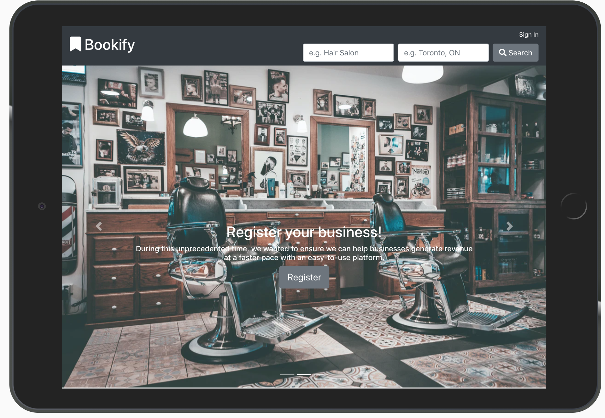

# Bookify

## Description
Bookify is a convenient web application designed to allow users to research and discover the ideal venue for whatever they are looking for. Whether you're looking for top reviewed barbershops, the cheapest auto repair shop or the top new restaurant in town, Bookify will not only find it for you but book it for you as well.

Bookify is simple to use, just search for what you're interested in and all the information you need will populate. You will be given addresses, images, reviews and for the options presented; you will also be given a featured option on the business page for i.e. a restaurant that is trending near you. Once you've made a decision, Bookify will give you the option to book that service directly through the app.

## User Story

We are Spartans; a development team from Toronto, Canada. We developed the idea for Bookify with convenience as our top priority. In today’s world, especially since the events of the global pandemic, it is vital to have instant information and updates on the places you are visiting. Having a one-stop-shop app to help people was our driving force.

## Table of contents
* [Abstract](#Abstract)
* [Motivation](#Motivation)
* [Usage](#Usage)
* [Demonstration](#Demonstration)
* [Technologies](#Technologies)
* [Development](#Development)
* [Contributers](#Contributers)
* [Licence](#Licence)

## Motivation

We wanted to have a positive impact on the world with this powerful new app. With Bookify we can help connect consumers with businesses through minimal contact and precision bookings. As a result, we created a one-stop-shop platform so both businesses and consumers didn’t have to go back and forth between apps like Yelp and Booksy.

During this unprecedented time, we wanted to ensure we can help both businesses and consumers generate revenue at a faster pace with an easy-to-use platform to assist them in their day-to-day lives.

## Usage
 
In order to use Bookify effectively, please access the deployed application at: INSERT LINK HERE and follow the instructions below.

New users will be required to "Register", and will be prompted to input everything from business name to category to location which will contribute to the basic aspect of their profile. In order to effectively be featured on the app, businesses must correctly identify what cateogry they are to be featured in along with services and booking times and locations they are registering.

For consumers, registration is mandatory to benefit from the app. Basic user registration is required consisting of essential information such as name, age, location, e-mail, etc.

## Demonstration
Sample Link: https://spartans-bookify.herokuapp.com/

](https://spartans-bookify.herokuapp.com/)

## Technologies

* Languages
    * html
    * css
    * javaScript
* Tools (Framework/Library)
    * MongoDB
    * Mongoose
    * node.js
    * Bootstrap
    * React
    * heroku
    * github

## Development
In the future, we will be implementing the following:
* Add Specific Booking Times in place of just “Booking”.
* Integrate to instantly booking specific tables at a hair salon.
* Direct payment integration to prepay for service instantly.
* Add rewards program to incentivize continued use.
* In-depth reports and analytics for business dashboard.

## Contributers

The links to the GitHub accounts of contributers on this project:

[Edmund](https://github.com/wesycool)

[Samuel](https://github.com/samuelyoo)

[Chet](https://github.com/Chet1317)

[Moni](https://github.com/smggg)

## Licence

MIT License

Copyright (c) 2020 Spartans

Permission is hereby granted, free of charge, to any person obtaining a copy of this software and associated documentation files (the "Software"), to deal in the Software without restriction, including without limitation the rights to use, copy, modify, merge, publish, distribute, sublicense, and/or sell copies of the Software, and to permit persons to whom the Software is furnished to do so, subject to the following conditions:

The above copyright notice and this permission notice shall be included in all copies or substantial portions of the Software.

THE SOFTWARE IS PROVIDED "AS IS", WITHOUT WARRANTY OF ANY KIND, EXPRESS OR IMPLIED, INCLUDING BUT NOT LIMITED TO THE WARRANTIES OF MERCHANTABILITY, FITNESS FOR A PARTICULAR PURPOSE AND NONINFRINGEMENT. IN NO EVENT SHALL THE AUTHORS OR COPYRIGHT HOLDERS BE LIABLE FOR ANY CLAIM, DAMAGES OR OTHER LIABILITY, WHETHER IN AN ACTION OF CONTRACT, TORT OR OTHERWISE, ARISING FROM, OUT OF OR IN CONNECTION WITH THE SOFTWARE OR THE USE OR OTHER DEALINGS IN THE SOFTWARE.

**GitHub Repository:** (Insert Link Here)     
**Deployed Heroku Application:** (Insert Link Here)